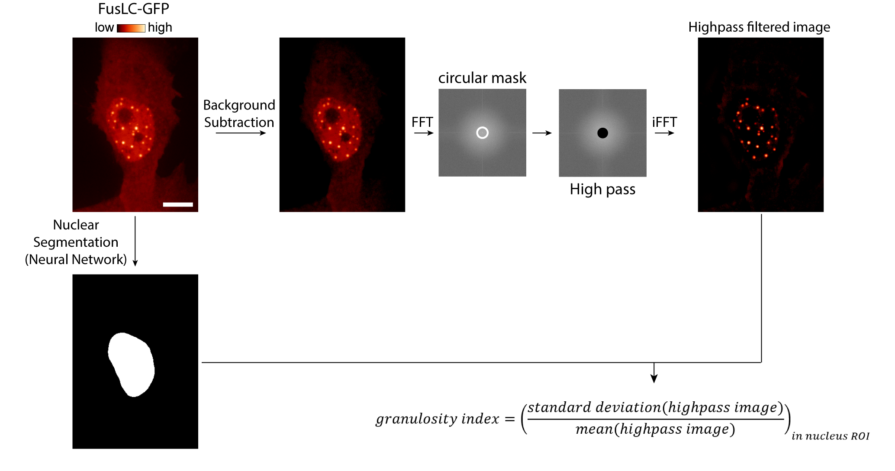

# Granulosity Index
<p align="center">
  
</p>
Code for calculating granulosity index, from Watson et al., 2023

# Setup
First, clone the repo:
```
git clone https://github.com/deriverylab/granulosityindex.git
```

# Calculating Granulosity Index on an image
The `calculate_granulosity_index.ijm` file is an ImageJ macro, and as such, will need to be run in ImageJ (or Fiji). 

To run, simply open the macro in ImageJ/Fiji, along with the image you'd like to calculate the Granulosity Index for. If it is a cell image, you'll probably want to include one (or more) active regions of interest, around (for example) the nucleus.

Then, you can just run the macro, provide the necessary inputs, and you'll be left with a `.txt` file with the results.

# Acknowledgements
We thank Nicolas Chiaruttini for his help in developing this code.
